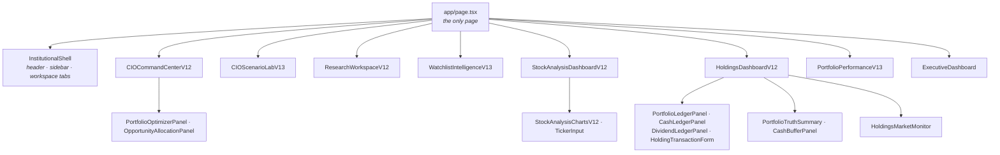
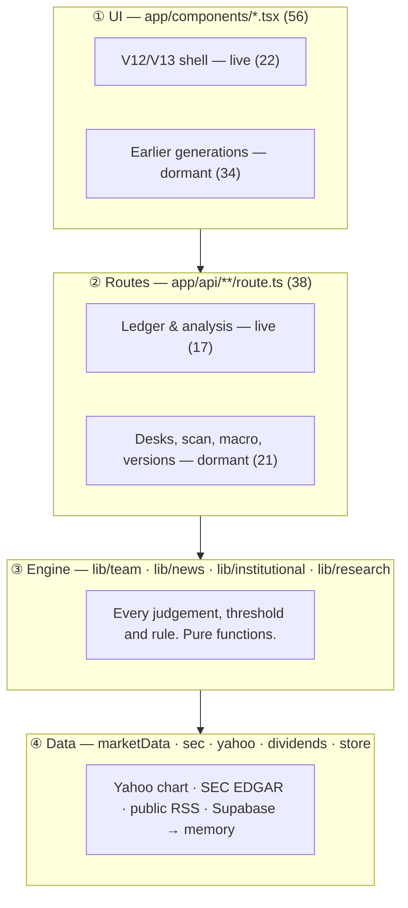

# Architecture — what is live, what is dormant, and how it fits together

**Written against `main` as it stands.** Every count below was measured from the
tree, not recalled: 38 API routes, 56 components, 61 library modules, ~26,600
lines of TypeScript.

The app was built in generations — V7 through V13 — and each generation left its
predecessor in place. That is a reasonable way to move fast, and it is also why
this document leads with the thing that matters most for planning: **rather more
than half the UI and roughly half the routes are no longer reachable from the
page.** Nothing here proposes deleting any of it. The point is to make the
choice deliberate.

---

## 1. What actually runs

`app/page.tsx` is the only page. It mounts eight components, and through them a
tree of **22 of the 56 components**.



**Live routes — 20 of 39**, all reached from the tree above:

```
analyze · analyze/actions · analyze/export · analyze/performance
portfolio · portfolio/analytics · portfolio/cash · portfolio/cash-buffer
portfolio/dividends · portfolio/integrity · portfolio/transactions
portfolio/opportunity-allocation · portfolio/optimizer
committee/meeting · macro/intelligence · v10/cio
alpha-discovery · holding-market · symbols · watchlist
```

Note that `useFundSnapshot.ts` is a `.ts` module, not a component, and three
routes reach the page only through it — `macro/intelligence`, `v10/cio` and
`portfolio/analytics`. A dependency walk that only follows `.tsx` files reports
them as dormant. They are not.

The live half is coherent and has a clear centre of gravity: **the ledger is the
source of truth**. `portfolio/transactions` records what happened, the fund
snapshot derives position and cash from it, and `portfolio/integrity` checks the
derivation. Everything else in the live set hangs off that.

---

## 2. What is built, tested, and not mounted

**34 components (6,181 lines) and 19 routes** are unreachable from the page.
This is not dead-by-neglect in the usual sense — much of it is recent, complete
and covered by tests. It is simply not wired to the current shell.

| Dormant area | Routes | Components | Engine still intact |
|---|---|---|---|
| **The desk system** | `team`, `team-portfolio`, `committee/audit`, `committee-memory` | `TeamPanel`, `PortfolioTab`, `EndToEndInvestmentCommittee` | `lib/team/*` — memo, book, round table, risk register. **The round table and risk register are now live** through `committee/meeting`; the rest is still unmounted. |
| **Scanners** | `scan`, `active-fund` | `ScannerTab`, `AlphaScannerV2`, `AlphaDiscoveryPlatform`, `ActiveFundManager` | `momentumV62` · `factorDiscovery` · `dividendScan` · `thematicPortfolio` (behind `/api/scan`); `lib/scan.ts` three-desk pipeline (behind `/api/active-fund`) |
| **Research workbook** | `workbook` | — | `lib/workbook.ts` (1,350 lines, 6 sheets) |
| **Macro & news** | `macro/intelligence`, `macro/history` | `MacroDesk`, `NewsDesk`, `MacroIntelligencePanel` | `lib/news/*`, `lib/team/macroPlan`, `fearGreed` |
| **Price windows** | `quote` | `PriceMove`, `PortfolioAnalytics` | `lib/priceMoves.ts` |
| **Committee execution** | `portfolio/rebalance-execution`, `portfolio-facts` | `CommitteeMeetingV10`, `PortfolioIntelligence` | ledger write path |
| **Older generations** | `v7/*`, `v8/*`, `v9/*`, `v10/cio`, `system/health`, `sectors`, `research/performance`, `watchlist/track` | `CommandCenterV10`, `FundOperatingCycle`, `FundCommandCenter`, … | `lib/institutional/v7.ts`, `v8.ts` |

`watchlist/track` is reached from nothing at all, live or dormant.

**Two scanner engines now exist side by side.** `/api/scan` runs
`momentumV62` / `factorDiscovery` / `dividendScan` / `thematicPortfolio` through
`guardScanResult`. `lib/scan.ts` — the three-stage momentum → catalyst → quant
pipeline with the joint conviction score — is reached only through
`lib/activeFund.ts` and `/api/active-fund`. Both are complete; neither is
mounted; and a reader arriving at "the scanner" finds whichever one they
searched for first. Picking one is the highest-value item in §2.

The drift is already visible: `ScannerTab` renders a market-regime card from
`result.regime`, and `/api/scan` — which now answers through `momentumV62` —
returns no such field. The card silently renders nothing. Dormant code stops
matching the route it calls, and nothing reports it, because nothing runs it.

Concretely, three features that exist and are tested but cannot be seen in the
running app:

- **1D / 1W / pre-market columns and the STALE flag** — `lib/priceMoves.ts`
  (321 lines, 44 assertions). No live component imports `PriceMove`.
- **The committee round table and risk register** — `lib/team/book.ts`
  (449 lines, 75 assertions). Reached only through `/api/team`, which no live
  component calls.
- **The news desk** — `lib/news/*` (1,263 lines, 122 assertions). Same.

**This is the decision the structure is waiting on.** Three options, and they do
not have to be applied uniformly:

1. **Reconnect** — mount the panel inside the V12/V13 shell. Cheapest for
   anything whose engine is already correct; mostly a matter of rendering
   existing JSON in the new layout.
2. **Retire** — move to `app/components/_archive/` and delete the route. Keeps
   `git log` but takes it out of the build and out of the search results.
3. **Leave** — legitimate for `v7`/`v8`/`v9` health endpoints if the validation
   scripts in `scripts/` still exercise them.

What is *not* a good option is leaving it undecided, because every future search
of the codebase returns two answers and the newer one is not obviously newer.

---

## 3. The layers



Dependencies point downward only, and that discipline has held: no module under
`lib/` imports from `app/`. It is the reason the dormant half is recoverable —
the engines never depended on the UI that displayed them.

| Layer | Owns | Must not |
|---|---|---|
| **① UI** | Layout, formatting, the `—` that stands for a null | Compute a score or decide a signal |
| **② Routes** | Fetch orchestration, store access, response shape | Hold analytical rules |
| **③ Engine** | Every judgement and threshold | Touch the network |
| **④ Data** | Fetching, parsing, fallbacks, source labelling | Interpret what it fetched |

---

## 4. The ledger — the live app's spine

The most significant thing built since the V11 line, and the part worth
protecting from future restructuring.

```
supabase/ledger_first_portfolio_v13.sql
        │
        ▼
portfolio/transactions        every add, reduce and close, append-only
        │
        ▼
fund snapshot                 positions and cash DERIVED, never stored twice
        │
        ├── portfolio/cash · cash-buffer     broker cash vs reserve assets, kept apart
        ├── portfolio/integrity              re-derives and reports disagreement
        └── portfolio/analytics · dividends  everything downstream reads the snapshot
```

Three invariants hold this together, and each was a bug once:

1. **Position and cash are derived from transactions, never stored alongside
   them.** Two writable copies of one truth is how they diverge.
2. **Broker cash and reserve assets are different things.** A T-bill ETF is not
   settled cash, and the liquidity buffer is computed from broker cash only.
3. **The CIO review and the holdings table read the same snapshot.** Cost basis
   quoted twice from two paths is how a review contradicts the table it
   describes.

---

## 5. Engine → owner

Fourteen seats, each a module with a testable output. All of these are intact
regardless of whether their UI is currently mounted.

| Member | Module(s) | Produces | UI live? |
|---|---|---|---|
| Daniel Cho | `team/governance` · `thematic` · `macroPlan` · `fearGreed` | Regime, cash floor, group leadership, sleeve targets | ✗ |
| Maya Chen | `team/scoring` · `engines` | Momentum v3.0, hard blocks, entry layer | ✗ |
| Aisha Fontaine | `team/catalyst` | Measured PEAD, surprise history, theme, thesis | ✗ |
| Sofia Reyes | `team/growthInputs` · `research.ts` | Growth gate, moat evidence | partial |
| Marcus Webb | `team/intelligence` | Earnings quality, cash conversion | partial |
| Priya Nair | `team/samp` | 3-layer pressure read, entry veto | ✗ |
| Thomas Eriksson | `team/positionValuation` · `analysis` | Fair value, anchor stack | partial |
| Kai Tanaka | `team/risk` · `sizingV4` | ATR stops, zones, sizing ladder | ✓ |
| Lena Müller | `team/portfolio` | Sleeve balance, dual objectives | ✓ |
| Ryan Blackwood | `team/book` (liquidity) | Sessions-to-exit at 20% of ADV | ✓ |
| Nina Okonkwo | `news/*` | News pulse, feed quality, lineage | ✗ |
| Leo Tanaka | `priceMoves` | As-of timestamps, stale flags | partial |
| Miriam Osei | `team/governance` (gates) | 11 pre-trade gates, V/E/U flags | ✓ |
| James Hartwell | `team/memo` · `book` · `committee` | Final signal, precedence, casting vote | ✓ |

"partial" means the engine is reached through `/api/analyze` but its dedicated
panel is not mounted.

`lib/team/committee.ts` is where the separate measurements become one decision:
it takes each desk's read, produces one motion per position and per referred
idea, polls all fourteen seats, and balances sources against uses. It is a pure
module — `/api/committee/meeting` does every fetch and hands it plain data.
Seven of the seats above became live when that route was mounted.

---

## 6. Data sources

| Source | Used for | Why |
|---|---|---|
| **Yahoo public chart** | Prices, candles, dividends, extended hours | Keyless and works from a datacenter IP. `quote`/`quoteSummary` do **not** — cookie/crumb behaviour is blocked on cloud hosts, so `lib/yahoo.ts` routes everything through `chart()`. |
| **SEC EDGAR XBRL** | Financials, quarters, TTM, share count, SIC | The filer's own tagged numbers, keyless. |
| **Public RSS** | Fed, BLS, BEA, Treasury, financial press | Keyless; every failed feed is named in the coverage table. |
| **CNN Fear & Greed** | Sentiment | Preferred; a 6-component computed proxy takes over when unreachable and says so. |
| **Supabase** | Ledger, holdings, watchlist | Falls back to an in-memory store so the app runs unconfigured. |

Nothing is paid, and **nothing is estimated silently**. A figure with no free
verifiable source is `null`, flagged `[U]`, excluded from the denominator, and
the coverage percentage reports what that cost.

---

## 7. Conventions that are load-bearing

Each of these was a bug before it was a rule.

1. **Unverifiable is not zero.** Score `null`, exclude from the denominator,
   name the gap. Scoring misses as zero drags every reading toward the middle.
2. **Coverage normalisation.** `raw / evaluable × 100`, with the evaluable share
   printed.
3. **One number, one source.** The card and its thesis read the same object; the
   donut and the table use the same function. Two paths to one number is how
   they diverge.
4. **Derived, not duplicated.** See §4.
5. **Projections carry `[E]`** and the rule that produced them.
6. **Cached formula results** in the workbook — ExcelJS writes formulas with no
   value, and previews that do not recalculate render blanks.
7. **Failures degrade, they do not cascade.** News failing must not cost the
   macro plan.

---

## 8. Verification

| Layer | Mechanism | Scale |
|---|---|---|
| Engine | `tsc` compile + plain-node assertion scripts over fixtures | 356 assertions |
| Runtime | `scripts/validate-v7…v13.mjs`, `audit-runtime-safety.mjs` | per generation |
| CI | `.github/workflows/webapp-quality.yml`, `sentinel-quality.yml` | on push |
| UI | Playwright against route-intercepted fixtures, 1400px and 390px | zero page errors |

**Environment limit:** this container's egress allowlist blocks Yahoo, SEC, CNN
and the news hosts, so everything is exercised against fixtures fed to the real
modules. Live-feed behaviour is verified in deployment, not here.

---

## 9. Structural debt, with a cost

Ordered by what it costs to leave alone.

| # | Item | Cost of leaving it | Cost of fixing |
|---|---|---|---|
| 1 | **34 dormant components, 19 dormant routes** | Every search returns two answers; new work risks landing in the unmounted copy | A decision per area (§2), then an afternoon of moves |
| 1a | **`validate-v9.mjs` fails on `main`** — it asserts `V9InstitutionalStatus` is mounted, and it is not | `npm run validate:institutional` is red, so CI never reaches `typecheck` or `build` | Mount the panel or retire the validator with the component. Same decision as §2, and it is already costing the build |
| 1b | **Two complete scanner engines** (§2) | "The scanner" means two different things depending on which file you open | Pick one, retire or archive the other |
| 2 | **`/api/team/route.ts` — 554 lines, five modes, 30 lib imports** | The largest single handler; every mode's fetch orchestration is tangled with the others | Split to `team/[mode]/route.ts`, or extract five `buildXInput()` helpers. ~2h, mechanical |
| 3 | **`lib/workbook.ts` — 1,350 lines** | Six sheet builders in one file | Split per sheet, share `style.ts`. Low risk; the sheets barely interact |
| 4 | **`PortfolioTab.tsx` — 876 lines, dormant** | Four independent components in one file | Resolve with §2 — do not refactor something that may be retired |
| 5 | **Theme-proxy fetch repeated in four places** | 20 candle fetches per call site | One `loadThemeProxies()` with a per-request memo |
| 6 | **No request-level cache** | `getMarketData` runs several times per request path | A `Map` keyed on ticker for the life of the request |
| 7 | **`lib/analyze.ts` is minified to single lines** | Diffs are unreadable; a one-line change rewrites the whole line | Reformat once. Purely cosmetic, but it makes review possible |

**Deliberately left alone:** `positionValuation.ts` (798) and `engines.ts` (731)
are each one coherent rulebook. Splitting them would scatter a rulebook across
files, which costs more than the line count does.

---

## 10. Adding something new

1. **A new measurement** → a pure module in `lib/team/`, owner named in the
   header, returning `null` for what it could not measure and reporting coverage.
2. **A new view** → a component, formatting only — and **mount it in
   `app/page.tsx`**, or it joins §2.
3. **A new fetch** → `lib/marketData.ts` or a sibling, added to `data.sources`,
   degrading rather than throwing.
4. **Wire it through the route**, not around it.
5. **Test the null path** — that is where this app's bugs have actually lived.
